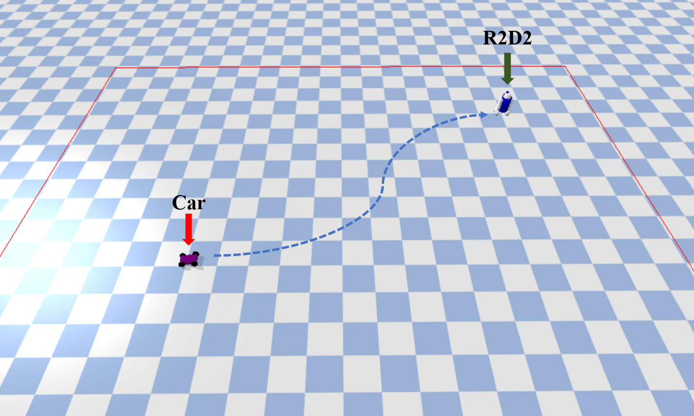
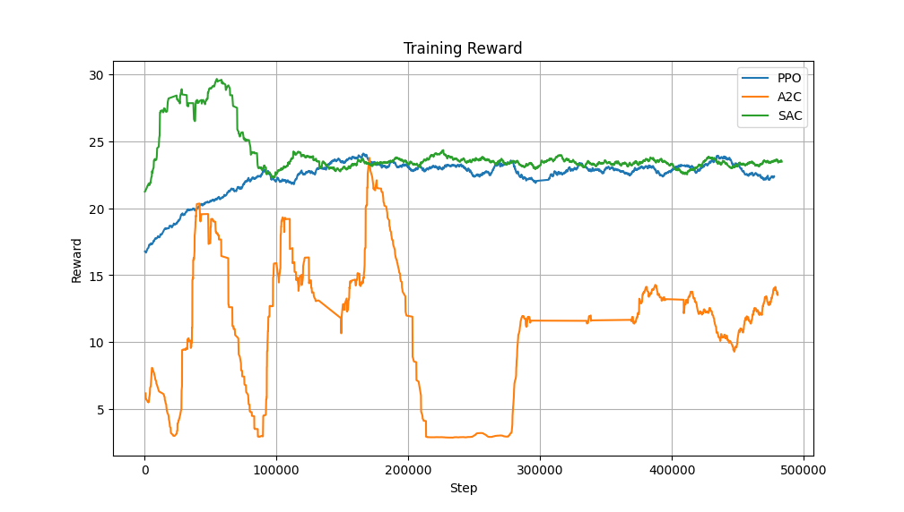

# Car Reinforcement Learning Training  

This project uses various reinforcement learning algorithms (such as PPO, SAC, A2C) for training, utilizing the PyBullet simulation environment. The goal is to train a simulated car to autonomously move and successfully navigate to the R2D2 location.

The car and r2d2 in the PyBullet simulation environment: 


---

## Results Showcase  

#### Training and Testing Process  
Watch how the car learns to navigate during training:


### Testing Results  
Here is the SAC algorithm performance in the testing environment:  


### Training Results  
Here is the reward comparison chart for different algorithms during the training process:  


### Algorithm Comparison  
Based on the testing results, the performance of the algorithms can be summarized as follows:

- **SAC (Soft Actor-Critic)**:  
  SAC performed the best in terms of reward accumulation and successful navigation to the R2D2 target. It showed consistent learning and high efficiency throughout the training process.

- **PPO (Proximal Policy Optimization)**:  
  PPO performed well with stable learning, though not as efficient as SAC. It still achieved good results in navigation tasks but required more training steps compared to SAC.

- **A2C (Advantage Actor-Critic)**:  
  A2C showed the worst performance among the three algorithms. It struggled to effectively learn and perform the task, with lower reward accumulation and more erratic behavior in comparison to SAC and PPO.

---

## Observation and Reward Explanation  

### Observation  
The observation vector consists of the car's position, orientation, velocity, and the target's position:

- The car’s position is represented by its coordinates on the x and y axes.
- The car’s orientation indicates the direction in which the car is facing.
- The direction in which the car is facing is determined by its orientation, which defines the car's movement direction.
- The car’s velocity is represented by its speed along the x and y axes.
- The target’s position is the location the car is navigating towards.

### Reward  
The reward is calculated based on the car's performance in reaching the goal and its behavior during the task:

- **Distance to Goal**:  
  The reward is influenced by the distance between the car and the goal. The car receives a reward based on the change in distance from one step to the next. The goal is to minimize the distance to the target.

- **Boundary Penalty**:  
  If the car crosses the boundary (i.e., if its position exceeds predefined limits), it is penalized with a reward of 0, and the episode ends.

- **Goal Achievement Reward**:  
  If the car reaches the target, i.e., the distance to the goal is below a certain threshold, it receives a large reward and the episode ends.

---

## Usage Instructions  

### 1. Setup the Environment  
- Use **PyBullet** for simulation to set up the interaction environment for the car and R2D2.  
- Define the car's observation space (perceiving R2D2's position and obstacles) and action space (car's acceleration, deceleration, and steering).  

### 2. Start Training  
- Choose from various reinforcement learning algorithms (like PPO, DQN, or A2C) for training.  
- Record the reward curve for each algorithm during training for comparison of performance.  

### 3. Test the Model  
- Load the trained model and test the car's navigation ability in different maps or scenarios.  
- Evaluate if the model can stably and efficiently navigate to the R2D2 location.  

### 4. Run Training or Testing  
To train or test the model, run the `main.py` script:

```bash
python main.py
